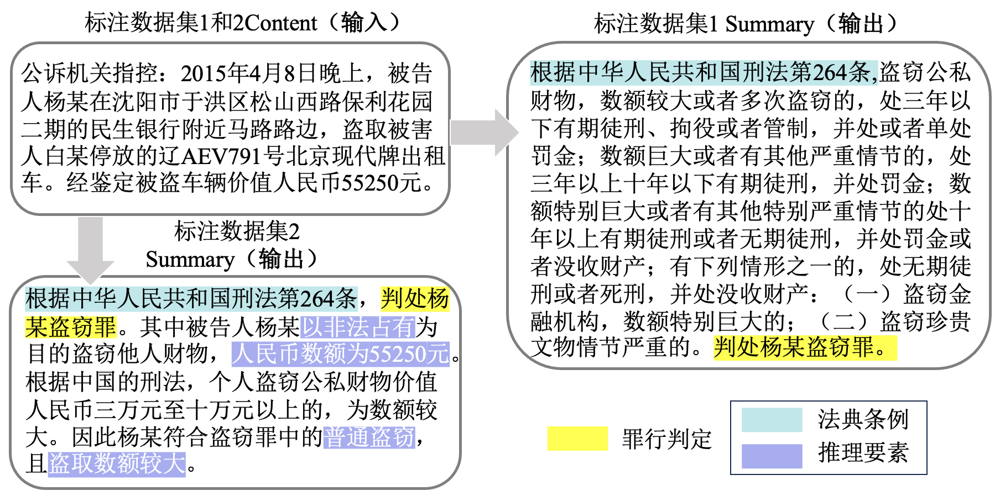

# Construction and Interpretability Evaluation of Large Language Model for Legal Judgement Prediction

<table align="center" style="border: 1px solid white;">
  <tr>
    <td style="border: 1px solid white;"></td>
  </tr>
</table>

The goal of legal judgment prediction (LJP) is to predict results based on facts and provide convincing explanations. This task plays a critical role in upholding fairness within the legal system. However, the conventional explainable techniques are often convoluted to grasp. Large language models have advantages such as natural language output and multi-round dialogue, enabling clearer explanation for users. The current evaluation benchmarks are limited in handling complex evidence. Therefore, there is an urgent need to develop an explainable large language model of LJP and evaluation benchmarks and methods that align with real-world judicial processes to guide and improve model development. 

## Table of Contents
1. [Overview](#overview)
2. [E-LJP Construction](#e-ljp-construction)
3. [Interpretability Evaluation](#interpretability-evaluation)
4. [Conclusion](#conclusion)

## Overview

Through the use of P-Tuning v2 technology, the ChatGLM-6B was fine-tuned to create a lightweight, localized LJP model known as **Explainable Law Judgement Predition (E-LJP)**. The E-LJP focuses on two main areas: predicting multi-crime judgment and crime judgment reasoning. Following the principles of subjective and objective consistency and elementary trial in legal decision prediction, we aim to establish a benchmark and evaluation methods for evaluating the prediction based on concept forest. This dataset seeks to uncover the connections and differences between decision-making reasoning for crimes and the overarching concepts across different crimes. The overview of construction and interpretability evaluation of LLM for LJP shows as follows:

<figure style="text-align: center;">
  
</figure>

**Contact**:

  <ul>
    <li>Wangyue Li  (<a href="mailto:alee90792@gmail.com">alee90792@gmail.com</a>)
    <li>Wei Deng (<a href="mailto:dengwei@swufe.edu.cn">dengwei@swufe.edu.cn</a>)
  </ul>

## E-LJP Construction

For the task of predicting legal judgments, the E-LJP model is positioned for the public without relevant professional knowledge. By incorporating legal provisions and deducative content into the fine-tuning data set, the model automatically contains legal provisions and deducative content in the output, so as to "explain" its criminal judgments to the public. On the explainable output of the model, we construct two models (multi-crime sentence prediction model and crime sentence prediction inference model) to achieve two different explainable functions: (1) The interpretation is based on the output of the criminal law regulations and specific contents of the sentenced crime; and (2) the interpretation is based on the output of the criminal law regulations of the sentenced crime and the key elements extracted from the case statement. The frame diagram of E-LJP model is shown in the following figure: 
 

<figure style="text-align: center;">
  
</figure>

### Model Annotations

For the annotated data set of Model 1, we use the regularization matching method to annotate. As for the labeling data set of Model 2, before manual labeling, we sort out the constitutive elements of the four crimes, so as to simulate the key elements extracted by judges and lawyers when making judgments of crimes. The figure below shows a labeled dataset on theft. You can see the annotation datasets in `Model1 Annotation` and `Model2 Annotation`.

<figure style="text-align: center;">
  
</figure>

### ChatGLM-6B P-Tuning

<figure style="text-align: center;">
  
</figure>

## Interpretability Evaluation

<figure style="text-align: center;">
  
</figure>

## Conclusion
